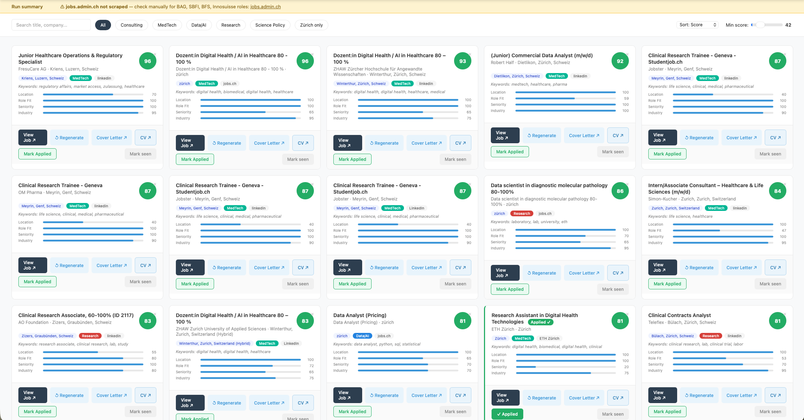

# Generic Job Search Agent

A Claude Code job-search coach: parses your CV, learns your job-search preferences through a guided interview, scores scraped job postings against your own rules, and generates a tailored CV + cover letter for the ones worth applying to.

This is a genericized, config-driven version of an agent that was originally built and validated for one specific person's job search (health/MedTech, Zürich). Nothing in `engine/` knows about any particular field, city, degree, or language — every rule lives in `config.yaml` and `cv_system/cv_data.yaml`, which `/setup` builds for you. The engine has been regression-tested to behave identically to the original hand-tuned version on real data, and separately smoke-tested end to end against a fictional persona in a completely different field (ESG/climate policy, Berlin) to confirm it generalizes and never leaks anyone else's information into your CV or cover letter.

If you've used [MadsLorentzen/ai-job-search](https://github.com/MadsLorentzen/ai-job-search) this will feel familiar — same `/setup` → `/scrape` → `/apply` shape. The difference here is the scoring engine: this one is built around an explicit, inspectable rule set (keyword tiers, disqualifiers, domain gates) that you can read and hand-tune, rather than an LLM judgment call on every posting, and it deliberately separates *mechanical* CV tailoring from a *personal* cover-letter interview (more on why below).

```
/setup                          /scrape                           /apply
  |                                |                                 |
  v                                v                                 v
Parse your CV               Search preferred_sources          Generate CV + cover
Configure search +          + general web search              letter for top-ranked,
scoring rules                 |                                not-yet-applied leads
Personalize cover letter      v                                 |
  |                       Score every posting                   v
  v                       against YOUR rules                 Build HTML report
config.yaml +                 |                                 |
cv_data.yaml ready            v                                 v
  |                     data/job_leads.json  ---------->  output/job_report.html
  |                     (ranked, deduped)                  (links to every CV/CL)
  v
CUSTOMIZATION_REPORT.md
(what got configured, and why)
```

Every phase of `/setup` ends with a **Checkup** — a plain-language readout of exactly what got configured and how it will behave, before moving to the next phase. This is deliberate: the point of a wizard is that you can catch a bad answer while it's still cheap to fix, not three phases later inside a generated cover letter.

## What it looks like

`python3 engine/server.py` opens an interactive dashboard at `http://localhost:5555` — filter by profile, search by title/company/location, slide the minimum score, and act on each posting directly (View Job, Regenerate, Cover Letter, CV, Mark Applied, Mark seen):



`engine/cli.py report` also builds a plain static `output/job_report.html` — no server needed, just a file you can open, print, or send to someone else. It doesn't have the interactive buttons; use the server for actually working through your leads day to day.

## Quick start

1. Clone this repo, `pip install -r requirements.txt`, and open the folder in Claude Code.
2. Run `/setup`. If you already have a list of jobs you've applied to (even an informal one), it'll ask for that first and use it to calibrate the rest of the interview instead of starting from a blank guess. Then you'll paste or upload your CV, answer questions about the roles/locations/languages/companies/portals you're targeting, and give Claude 2-4 real stories to draw from for cover letters. After every phase, Claude shows you a **Checkup** of exactly what it configured, so you can correct anything before moving on. This produces:
   - `cv_system/cv_data.yaml` — your CV content, ATS keyword allow-list, and cover-letter building blocks
   - `cv_system/config_<variant>.yaml` — one file per CV "flavor" you want
   - `config.yaml` — your job search terms, preferred sources, locations, watchlist companies, and every scoring/disqualification rule
   - `CUSTOMIZATION_REPORT.md` — a plain-language summary of everything that got configured and why
3. Run `/scrape` whenever you want fresh postings. It checks your `preferred_sources` first, then general search, scores everything against your rules, and reports exactly which queries ran and why postings were kept or filtered.
4. Run `/apply` to generate a CV + cover letter for your top-ranked, not-yet-applied postings, and build `output/job_report.html`.
5. Run `python3 engine/server.py` and open `http://localhost:5555` to work through your leads day to day — filter, search, regenerate a single CV/CL, and mark postings Applied or seen without hand-editing JSON.

You can also just describe changes in plain language at any time — "stop showing me anything with 'Manager' in the title" or "add a fourth cover letter story about X" — and Claude will edit the underlying config directly, no need to re-run `/setup`.

## Reviewing & archiving jobs

The server has two dismissal actions that look similar but mean different things, and the distinction matters:

- **Mark seen** sets `rejected: true` on that posting in `data/job_leads.json`. It disappears from the dashboard immediately and stays hidden on future `/scrape` runs (the merge step in `engine/cli.py score` preserves this flag by matching on `id`). Use this for "not for me" — postings you looked at and don't want to see again, but never applied to.
- **Mark Applied** sets `applied: true` on the same record *and* appends a copy of it (title, company, score, date, notes, CV/CL paths, URL) to `data/applications_archive.json`. The posting stays visible on the dashboard (with a green "Applied" badge) rather than disappearing, and shows up on `/archive` — the point is to keep a running record of what you've actually sent out, not to hide it.

Why a local JSON file rather than syncing to Notion, Airtable, or a spreadsheet the way the original personal version of this agent did: that original sync only worked because the person already had a Notion database and API token configured — it's real setup cost that has nothing to do with whether the agent itself works. A local file needs zero setup and works identically for everyone who clones this repo. It also already has every field a sync target would need, so if you do use Notion/Airtable/Sheets, the honest move is to just ask Claude directly — "add a step to `/api/apply` in `engine/server.py` that also pushes this record to my Notion database at `<url>`" — rather than this template guessing at your setup and getting it wrong.

## How CV tailoring actually works (and why it's safe to run unattended)

CV tailoring is **mechanical, not generative** — this is the most important design decision in this repo, so it's worth showing rather than just asserting.

Say `cv_data.yaml` lists this skill line for the "consulting" CV variant:

```
Sustainability & ESG Analysis: Carbon accounting, ESG reporting, CSRD, materiality assessment, benchmarking
```

and `skill_signals` (built from your real CV during `/setup`) includes the pair `["environmental impact", "environmental impact assessment"]`. A posting for "Environmental Consultant" that mentions *"You will conduct environmental impact assessment work..."* gets scanned, matches that signal, and the line becomes:

```
Sustainability & ESG Analysis: Carbon accounting, ESG reporting, CSRD, materiality assessment, benchmarking, environmental impact assessment
```

That's the entire mechanism (`engine/cv_generator.py: extract_keywords` + `generate_cv_for_job`). It will **never** add a skill label that isn't already in your own `skill_signals` — there's no LLM call in this path, no chance of it inferring you know something you didn't tell it. The same mechanism swaps in the right variant, reorders skills, and fills your summary template with the job's company name and detected "role area." Zero fabrication risk, which is what makes it safe to run against 20+ postings in a batch without reviewing each one before it goes out.

## How cover letters actually work — and exactly why some parts change per job and others never do

A cover letter has three tiers of content, not two, and each tier is treated differently on purpose:

**1. Structurally fixed, identical in every letter you ever generate:** the HTML shell/CSS, the greeting ("Dear Hiring Team,"), the closing ask ("I would love the chance to meet..."), and the signature block. This is deliberate, not laziness — there is no legitimate per-job reason for your greeting or signature to differ, so varying them would add zero signal for the reader while adding a real cost for you: N letters that each need re-proofreading for structural drift, instead of one shell you check carefully once and then trust completely. If you ever catch yourself wanting to change this per job ("make the closing warmer for startups"), that's a sign you want a second CV variant's tone, not a per-job cover letter edit.

**2. Fixed content that's still personal — `personal_passage`.** This is the one part of the letter that's static text, unchanged across every job, and that's also deliberate: a personal note ("I spend my weekends cycling and gardening") is either true about you or it isn't. There's no honest version of that sentence that's different for job A than job B. Making it vary per posting would mean inventing a different personal story to match each employer, which is fabrication with better production values, not personalization. It stays constant because that's the only way it stays true — or you can leave it empty, which is equally legitimate.

**3. Actually dynamic per job — the hook, the evidence paragraph(s), and the "why this company" line.** These change because there's a real, job-specific question to answer each time: *which of your real experiences is actually most relevant to this posting, and what genuinely differentiates this employer from the last one?* Both questions have different correct answers for different postings, so the content that answers them has to change too. This is where `experience_catalog` (gathered once, during `/setup` Phase 3) does its work: each story has trigger keywords and a `background`/`current` tag, and the posting's own text decides which story or story-pair actually leads.

For a "Junior ESG Consultant" posting, the fictional Alex Berger config (shipped as the worked example — see `templates/cv_data.example.yaml`) produces:

> *My master's thesis built a comparative carbon accounting framework across three manufacturers ahead of CSRD requirements, which is close to exactly what the Junior ESG Consultant role at GreenLine Advisory is asking for.* [...] *At Berlin Climate Consulting I build emissions inventories and ESG reports for mid-cap clients, translating raw sustainability data into decision-ready reporting.*

Two stories, ordered because one is tagged `background` (the thesis) and the other `current` (the present job) — background introduces the narrative, current shows where it applies today. A different posting's keywords surface a different story or a different pair, in a different order.

**What breaks if you move the boundary either direction.** Make tier 1 dynamic too, and you've traded a battle-tested template for N inconsistent ones with no upside — no employer benefits from a slightly different sign-off. Make tier 3 static instead (one evidence paragraph reused everywhere), and you get a letter that's accurate but reads as obviously mass-produced, which defeats the actual point of writing a cover letter at all: showing you read the posting and thought about fit. The rule of thumb underneath all three tiers: content varies per job only when there's a real, job-specific question behind it — otherwise varying it is just risk with no signal.

A generic writing-quality filter also runs on every letter (banned AI-sounding phrases, em/en-dash-as-separator detection) and flags anything worth a manual look.

## Customization tips (read this before your first `/setup` run)

- **Preferred sources matter more than you'd think.** `config.yaml`'s `preferred_sources` field tells `/scrape` which job boards to check *directly* (e.g. LinkedIn, Indeed, StepStone) before falling back to general web search. If your market concentrates on one or two boards, say so explicitly — an empty or vague answer here means `/scrape` is guessing where to look, and you'll get a thinner result set without knowing why.
- **Double-check your keywords against real postings, not just your own vocabulary.** During the Phase 2 Checkup, Claude shows you the literal disqualification rules and role-profile keyword tiers in plain language. Read them against 2-3 real postings you already like or dislike — it's much cheaper to fix a keyword tier before `/scrape` runs than to wonder later why a good posting never showed up.
- **Language is not automatic.** If your target market posts jobs in more than one language (German/English is common in DACH, for instance), say so during Phase 2 — `domain_context_keywords`, disqualification patterns, and search terms all need an entry per language, or a posting written only in the language you didn't configure will silently fail every rule. This failure mode is invisible unless you ask for it, so the Phase 2 Checkup explicitly calls out which language each rule set covers.
- **Search profiles are about roles, not portals.** `search_profiles.<name>.terms` should be adjacent title phrasings for one type of role ("ESG Consultant" → "Sustainability Consultant" → "Carbon Accounting Analyst"), not a mix of role terms and site names — portal targeting is `preferred_sources`' job, keep the two separate so each stays legible.
- **You don't need to get it perfect on the first `/setup` run.** Every checkup exists so you can fix things immediately, and every rule can be changed later just by asking Claude in plain language — "add German synonyms to my disqualifiers" works without re-running the whole interview.

## Why it works this way (lessons from building the original agent)

These aren't arbitrary defaults — each one exists because of something that broke or worked unexpectedly while building and running the original, non-generic version of this agent for months.

- **No hardcoded portal scrapers.** An early version used site-specific CSS selectors per job board. They broke every time a portal changed its markup, and don't transfer across countries. `/scrape` uses general web search/browsing tools instead, guided by `preferred_sources` — slower per-query, far more resilient, and it's the only approach that generalizes to a new user's market without you writing a new scraper.
- **Broad recall, then filter — not narrow search terms.** Early search terms were narrow and exact-match, which missed good postings that used slightly different phrasing. The fix was to deliberately widen the search terms (adjacent titles, not just the exact one) and let the *scoring rules*, not the search terms, do the precision work. This is why `/setup` pushes you to brainstorm 3-5 phrasings per role instead of just one.
- **Disqualifiers are tiered (hard / soft / domain-gated) instead of one blunt reject list.** A single keyword blocklist either lets through too much noise or blocks legitimate adjacent-field postings (e.g. "Data Engineer" inside a company that's genuinely in your target field). The fix: hard rules for things that are never right, and soft rules that get overridden if the posting also has enough `domain_context_keywords` hits — this needed several iterations of "why did this good posting get filtered" before landing on the current shape.
- **Disqualified postings are capped, not deleted.** `disqualify_cap` and `senior_cap` mean a disqualified posting still shows up (at a low score) instead of vanishing — so if a rule turns out to be too aggressive, you can see it happening in the report and fix the rule, instead of silently losing postings with no way to notice.
- **CV tailoring is mechanical; cover letters are interviewed.** Early attempts had the CV generator make small "would probably have" inferences about skills the person likely had. Even when correct, this was a fabrication risk with no upside — a skill allow-list built from the person's own CV removes the risk entirely with no quality loss, because the tailoring that actually matters (which skills to *foreground*, not which to *invent*) doesn't need inference. Cover letters are the opposite case: there's no allow-list substitute for an actual story, so that part stays a real interview.
- **The engine reads config, never contains it.** `engine/scorer.py` and `engine/cv_generator.py` were regression-tested against the original hand-tuned scorer (25 real postings, 0.00 average score difference) after this split, which is what makes it safe to say the algorithm itself is unchanged — only where the rules live changed.

## File structure

```
config.yaml                 # YOUR search + scoring config (created by /setup, gitignored)
CUSTOMIZATION_REPORT.md     # YOUR plain-language record of what got configured and why (created by /setup, gitignored)
requirements.txt            # PyYAML, Jinja2, Flask
cv_system/
  cv_data.yaml               # YOUR CV content + cover-letter data (created by /setup, gitignored)
  config_*.yaml               # YOUR CV variant configs (created by /setup, gitignored)
  template.html               # shared CV HTML template — generic, not user-specific
engine/
  scorer.py                   # generic scoring engine — reads config.yaml, no hardcoded field/city/language rules
  cv_generator.py              # generic CV + cover-letter generator — reads cv_data.yaml + config.yaml
  cli.py                      # `python3 engine/cli.py score|generate|report` — used by /scrape and /apply
  server.py                   # `python3 engine/server.py` — interactive local dashboard, used day to day
templates/
  config.example.yaml          # documented reference config, fictional "Alex Berger" persona
  cv_data.example.yaml         # documented reference CV data, same fictional persona
  smoke_test_jobs.json         # synthetic postings used to validate a fresh /setup run
docs/
  screenshots/                 # the one dashboard screenshot referenced above (see below to generate your own)
.claude/commands/
  setup.md / scrape.md / apply.md   # the three slash commands, including the Checkup instructions
data/
  job_leads.json               # scored postings (gitignored)
  applications_archive.json    # jobs marked Applied, with notes + doc links (gitignored)
  scrape_warnings.json         # sources /scrape couldn't check this run, shown as a dashboard banner (gitignored)
output/                       # generated CVs/CLs + the static report (gitignored)
```

Two files ship pre-filled rather than gitignored, as worked examples of the variant-config schema: `cv_system/config_consulting.yaml` and `cv_system/config_policy.yaml`. They belong to the same fictional persona as `templates/*.example.yaml` — `/setup` creates your own `cv_system/config_<variant>.yaml` files alongside (or instead of) them.

## Which files to edit manually

You don't have to use `/setup` — if you'd rather hand-edit:

| File | What to change |
| --- | --- |
| `cv_system/cv_data.yaml` | Your CV content, `skill_signals` (ATS allow-list), `experience_catalog` (cover-letter stories), summary templates |
| `cv_system/config_<variant>.yaml` | Per-CV-variant layout: subtitle, section order, accent color, which sections show |
| `config.yaml` → `search_profiles` / `search_locations` / `preferred_sources` / `company_watchlist` | What `/scrape` searches for and where |
| `config.yaml` → `scoring` | Every disqualification rule, keyword tier, weight, and threshold |

Re-run just the search/scoring interview without touching your CV or cover letter by asking Claude directly, e.g. "let's redo Phase 2 of setup, my priorities changed."

## Generating the dashboard screenshot yourself

The one above is from a real run. If you'd rather show your own (or the layout has changed since), regenerate it after running `/setup` and `/apply` once:

```
python3 engine/server.py
```

open `http://localhost:5555`, take a screenshot (macOS: Cmd+Shift+4), and save it as `docs/screenshots/localhost_dashboard.png` — that's the exact path the image link above points at.

## Troubleshooting

- **`/scrape` finds almost nothing.** Check the Scrape Checkup output for the disqualification breakdown — if most postings are being rejected by one rule, that rule is probably too aggressive. Also check whether postings in your market are in a language your `domain_context_keywords`/search terms don't cover.
- **Generated cover letters feel repetitive.** You likely only gave `/setup` one or two `experience_catalog` stories with broad trigger keywords, so the same one fires for everything. Ask Claude to add more stories with narrower, more specific trigger keywords.
- **A CV keeps claiming a skill you don't have.** This should be structurally impossible (`extract_keywords` only reads from your own `skill_signals`) — if it happens, it means something got added to `skill_signals` that shouldn't have been; ask Claude to remove that specific signal pair.
- **`python3 engine/server.py` fails with `ModuleNotFoundError`.** Run `pip install -r requirements.txt` first — the server needs Flask, which the scoring/generation engine alone doesn't.

## Acknowledgements

Structural inspiration (the `/setup` → `/scrape` → `/apply` command shape, and the idea of a plain-language customization record) from [MadsLorentzen/ai-job-search](https://github.com/MadsLorentzen/ai-job-search). Built with [Claude Code](https://claude.com/claude-code).
